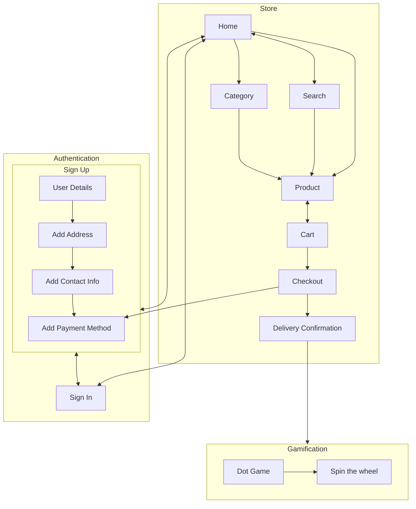

# Project Scoop - ID Assignment 2

Welcome to Project Scoop! 

Finding current style of ecommerce website as well as the checkout process boring? Well, we got you. Presenting to you a new and improved website for the brand, Scoop Wholefoods. This updated platform allows users to view and purchase in-stock items of their choice while earning rewards and discounts as a member. In addition to that, gamification features have been added to elevate users’ shopping experience. 

From attracting the user’s attention to enhancing every user’s shopping experience, all features and design are researched, refined and well-thought of from all aspects. An upgrade of the UI and UX will definitely bring in more users as well as more returning users while standing out from the crowd. The process has been streamlined to ensure a smoother flow from signing up to checking out.  This modern and minimalistic website is created with the goal of a seamless purchase and transaction process. 
## Design Process
### Phase One - Ideation
When we first received this assignment, we were given multiple projects to work with. After much consideration, we decided to proceed with an ecoomerce website with an addition of gamification features as we able to execute most of the requirements such as the usage of API(s) and Lottie animation. Before kicking off the projects, we did research on the current large and small e-commerce websites such as Lazada and Shoppee to gather information and inspiration on the designs and other interesting featues which can be used when creating the website. Since online shopping is gaining popularity rapidly worldwide, we are able to get hold of some of the users' experiences when they shop in other websites. We took down what are some of the negative and unsatisfactory reponses as well as the positive ones to be used when designing and constructing the website. 

Deciding on the materials and display products was not an easy task. After hours of researching, the team agreed to use [Scoop Wholefoods Sg](https://sg.scoopwholefoods.com/) as a basis of the website. Knowing that there is also an ecommerce website for Sccop Wholefood, we decided to recreate the website with brand new design alongside interesting features such as spin the wheel game. Using the same products and category, we narrowed down to 6 different category with 10 products each to simpolify the project. 

### Phase Two - Design/Prototype
#### Front-End
While designing the website, we kept in mind of the useful features which can be implemented as well as user interactivity with the site while ensuring a smooth process throughout. Using Adobe XD as a wireframe tool, we started designing and followed a theme suggested by Jia Chen that suggest a minimalistic and neat look. Both desktop and mobile view was taken into consideration when designing the framework. To reduce complexity, only four cool colours - **insert here** - were chosen and one consistent font was used throughout. Rounded edges boxes and buttons were used to increase the effectiveness of the website. Relevent graphic design, interface design, user experience design were added accordingly. 

Wireframe document: [shared link](https://xd.adobe.com/view/156c3b6b-6028-4da8-9f91-a24643752036-403f/)

#### Back-End
As one of the requirements, web APIs needs to be implemented. Since [RestDB]() was taught during lesson, we decided to utilize it in the project as our database platform. Familiarity with the application allows us to easily work with our current design and gather the necessary data to the stored in it. Planning and creation of the database and other information was done alongside the wireframe design. 

Design Flowchart:

### Phase Three - Coding
After getting confirmation from our lecturer on our idea, we then proceed to start coding using the IDE, [Visual Studio Code](). Work is divided and delegated between the members based on the different sections of the website. Coding time is also carefully planned out in so as to prevent any conflict of the same code being edited at the same time. Knowing that more people view ecommerce websites on desktops, we decided to put more emphasis on the desktop version while setting the mobile version secondary in importance. We made sure to keep each other updated on our progress and helped out when needed while coding in accordance with the wireframes design. We also strictly followed the wireframes design
 While coding according to the wireframes design, we made sure to update one another in our progress and help out when anyone is in need.  

### Phase Four - Test/Launch
In this final stage

Before we started, we first thought of the needs of every shoppers as well as compare the processes of shopping from the selection to the payment. We then sieve out interesting and useful features from other website and implemented it into our website. Of course, we studied the basis of the orginal website and found out which areas can be improved. 

As this is a consumer-focused website, customers should be able to complete their shopping process within a limited number of clicks and breakpoints. Satisfactory customers is our top priority as they will always return to this site to pruchase more products. 

 

Provide us insights about your design process, focusing on who this website is for, what it is that they want to achieve and how your project is the best way to help them achieve these things.

In particular, as part of this section we recommend that you provide a list of User Stories, with the following general structure:
- As a user type, I want to perform an action, so that I can achieve a goal.

This section is also where you would share links to any wireframes, mockups, diagrams etc. that you created as part of the design process. 
These files should themselves either be included as a pdf file in the project itself (in an separate directory)
Include the Adobe XD wireframe as a folder. You can include the XD share url. 

## Features
### Existing Features
- Personalized Greeting
  - A personalized header containing the username will be displayed at the top of the Home Page for users who signs up for membership. A simple and general title, 'Hello' will be displayed instead for non-members.
  - Purpose: this feature provides a personalized feel by including the details of the users and this helps to improve user experience when they visit the website. 
  - {display}

- Search Bar
  - This general feature is located at the top of the Home Page, Product Page, Category Page, Cart Page and Payment Page. It allow users to navigate throughout the website to look for products which they have in mind. This helps to shorten the process of finding their desired products, improving the user experience. 
  - {display}

- Cart Button
  - Found at the top right corner of the Home Page, Product Page, Category Page, Cart Page and Payment Page, this features allow the ease of access to navigate to their checkout chart where they are able to view an overall of the products selected. This feature is only applicable to members as there is limited information of guests to enable them to use the feature. 
  - {display}

- Points Bar
  - This features is only available for members. When members checkout and made payment for their purchase, they are able to earn points depending on the amount and quantity of products purchased. The higher the amount spent, the more points earned. The limit on the total number of points accumulated is 1000 points. When the current points bar is full, it will reset to 0 points and the extra points are brought forward to the new bar. Every 1000 points earned will entitle members to play a few games and earn more rewards such as discounts and free products. With the implementation of this feature, non-members will be entice to sign up for membership and members can better visualize their progress of their points accumulation. 
  - {display}

- Quick Sign In and Sign Up 
  - The addition of two buttons in replacement of the points bar allows members to sign in or non-members to sign up to be able to purchase items and earn points. In guest mode, users are restricted to only view the products in each category but are able to carry out features set aside for members as mentioned in the previous line. Placed in the home page, users are able to easily access the sign in and sign up features
  - {display}

- For You/Popular Section
  - This feature found at the bottom of the home page introduces new and randomized products for users. A total number of 10 products will be displayed for the users. For members, the section is named 'For You' to add touch in personalization while the section is named 'Popular' for non-members. --more--
  - {display}

- Sold Out/New Logos
  - For products which are just released into the store, they are labelled with the 'New' logo, whereas for products which are unavailable due to limited or no stock will be labelled with the 'Sold Out' logo. 
  - {display}

- Products Display
  - Store items are presented to users in the form of cards with the item name, price and image. Due to time constraint, only 10 images from each of the 6 categories are displayed and users are able to click on any of the items which brings them to a product description and add to cart page. 
  - {display}

- Filters 
  - For each product in the Products Page, there are filters added at the bottom of the product name to provide more information such as Vegan and Halal for better understanding of the product. For the collated products in each category are also provided with the relevent filters containing the product category name for easier reference. 
  - {display}

- Selected Product 
  - When users select their preferred product, they are brought to a page where they are provide with the product description and they are able to checkout this product with a maximum quanitty of 10. They are also provided with the price alongside their points bar. They are only able to add the products, they set sight on, to the main cart in this page. 
  - {display}

- View Cart
  - 

- Confirm Payment

- predicted points bar 

- success page 

- animation 

- hyperlink 

- data validation 

- Add card

- Jumping Game 

- Wheel Game

### Features Left to Implement
- 

## Technologies Used
The following are the various languages, frameworks, libraries, and any other tools used to construct this project. 

- [HTML](https://html.com/)
- The project uses **HTML** to describe the structure of web pages.
- [CSS](http://css.com/)
  - The project uses **CSS** to describe the presentation of web pages, including colors, layout and fonts.
- [JavaScript](https://www.javascript.com/)
  - The project uses **JavaScript** to create highly responsive  and interactive interfaces that improve user experience and provide dynmic functionality.
- [JSON](https://www.json.org/)
  - The project uses **JSON** to transmit data in web applications. 
- [JQuery](https://jquery.com)
  - The project uses **JQuery** to simplify DOM manipulation.????????????????
- [Adobe XD](https://www.adobe.com/sg/products/xd.html)
  - The project uses **XD** as a design platform to create the prototypes/wireframes.
- [GitHub](https://github.com/)
  - The project uses **GitHub** uses a code hosting platform for version control and collaboration.
- [VSC](https://code.visualstudio.com/)
  - This project uses **Visual Studio Code** as a source-code editor for development operations like debugging, task running and version control.
- [RestDB]()
  - This project uses **RestDB** as a database tool to store user's information and purchase.

## Testing

For any scenarios that have not been automated, test the user stories manually and provide as much detail as is relevant. A particularly useful form for describing your testing process is via scenarios, such as:

1. Contact form:
    1. Go to the "Contact Us" page
    2. Try to submit the empty form and verify that an error message about the required fields appears
    3. Try to submit the form with an invalid email address and verify that a relevant error message appears
    4. Try to submit the form with all inputs valid and verify that a success message appears.

In addition, you should mention in this section how your project looks and works on different browsers and screen sizes.

You should also mention in this section any interesting bugs or problems you discovered during your testing, even if you haven't addressed them yet.

If this section grows too long, you may want to split it off into a separate file and link to it from here.

## Credits

### Content and Media
- Product Information - Name, Description, Price, Image are taken from [Scoop Wholefoods SG](https://scoopwholefoodsshop.com/collections/shop-all)
- Icons - The relevant icons are taken from [Icon]()
- Fonts - IBM Plex Sans, font used throughout the website, is taken from [Google Font]()
- Animation - The animated truck was taken from [Lottie]() 

### Acknowledgements
- [MEL]() - Reference on lesson materials and links.
- [W3 Schools]() - Reference on html, css and other content.
- [Youtube]() - Reference was taken for certain codes such as games.  
- [Stack Overflow]() - Reference on codes for specific content such as data validations for forms.

### Authors
- Lead Authors
    - Yee Jia Chen (Student)
    - Yong Zong Han Ryan (student) 

- Co-Author
    - Suresh Kumar Moorkath (lecturer)
