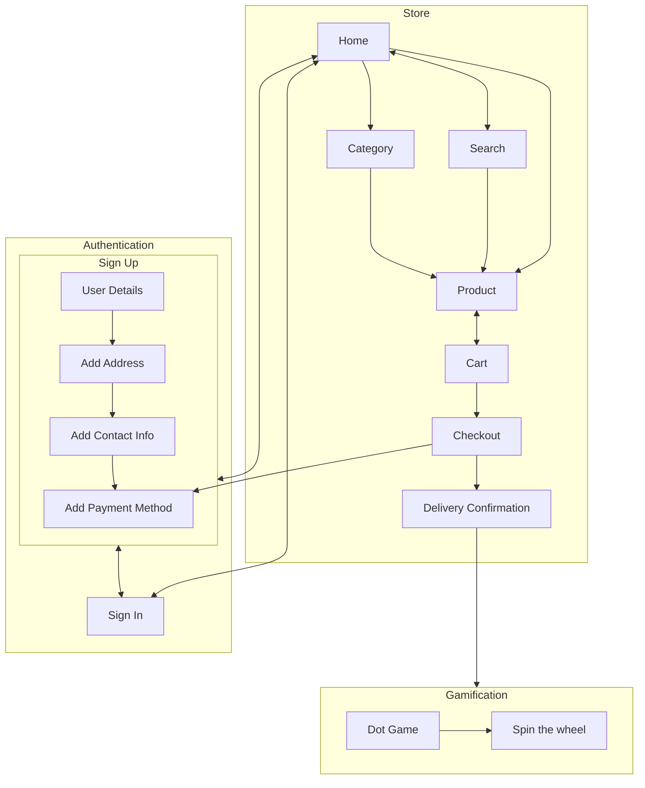

# Project Scoop - ID Assignment 2

Welcome to Project Scoop! 

Finding current style of ecommerce website as well as the checkout process boring? Well, we got you. Presenting to you a new and improved website for the brand, Scoop Wholefoods. This updated platform allows users to view and purchase in-stock items of their choice while earning rewards and discounts as a member. In addition to that, gamification features have been added to elevate users’ shopping experience. 

From attracting the user’s attention to enhancing every user’s shopping experience, all features and design are researched, refined and well-thought of from all aspects. An upgrade of the UI and UX will definitely bring in more users as well as more returning users while standing out from the crowd. The process has been streamlined to ensure a smoother flow from signing up to checking out.  This modern and minimalistic website is created with the goal of a seamless purchase and transaction process. 
## Design Process
### Phase One - Ideation
When we first received this assignment, we were given multiple projects to work with. After much consideration, we decided to proceed with an ecoomerce website with an addition of gamification features as we able to execute most of the requirements such as the usage of API(s) and Lottie animation. 

As we looked into other e-commerce websites, large and small, such as Lazada and Shopee, we felt that these sites were plastered with popups and intrusive ads with a clunky user interfaces and we felt that we improve upon this experience by designing a new e-commerce platform with the user at the forefront. This meant rethinking how we could potentially upsell users with products through recommendations and rewards instead. As we looked through these sites, we noted down what we liked, as well as did not like in each website and these notes helped to guide the design of our final site.

One of the things features we loved when looking at other e-commerce websites was the use of product images to feature the product prominently, though we found the ads and promotions getting in the way of the site itself, often times burying important sections like Categories beneath dozens of ads. We felt that, as a user, the goal is to get it done as quickly as possible and these overly large product ads were getting in the way of the goal.

Deciding on the products was not an easy task. After hours of researching, we agreed to use [Scoop Wholefoods SG](https://sg.scoopwholefoods.com/) as a basis of the website. Knowing that there is also an ecommerce website for Sccop Wholefood, we decided to recreate the website with a brand new design alongside interesting features we thought the website could benefit from, such as a more comprehensive rewards system, including a spin the wheel game. Using the same products and category, we narrowed down to 6 different category with 10 products each to simpolify the project based on the lecturer's feedback. 

In this phase, we have identified the following: 
- end-users: Scoop e-commerce shoppers (members) and general public (non-members)
- end-goal: to recreate the existing site into a minimalistic website with improved functionality.  

### Phase Two - Design/Prototype
#### Front-End
While designing the website, we kept in mind of the useful features which can be implemented as well as user interactivity with the site while ensuring a smooth process throughout. Using Adobe XD as a wireframe tool, we started designing the desktop and mobile view of the app. 

While designing the website, we kept in mind of the useful features which can be implemented as well as user interactivity with the site while ensuring a smooth process throughout. Using Adobe XD as a wireframe tool, we started designing the mobile view of the app. 

The reason we designed the mobile view first was to ensure the design would ultimately scale nicely for users on smaller devices and by structuring the design similar to what we had seen in other mobile apps, we created a simple-to-use mobile optimised design that would work perfectly on any device.

That said, several screens had to be edited to suit the varying screen sizes, notably the moble product page was heavily inspired by other e-commerce apps, however this design didn't make much sense on larger devices such as desktops and the design had to be rethought out for such cases.

In order to maintain consistency throughout the design, we stuck to 5 colours.
- a dark blue for text
- 2 background colours
  - a light blue and white to provide some amount of contrast.
  - In general, the white was used to highlight any information that was in the foreground while the light blue was used to highlight elements in the background
- 2 accent colours
  - The blue served as our primary accent or tint colour throughout the entire project. Maintaining a consistent accent colour helped to ensure that the site looked similar as the user navigated between pages.
  - The yellow served as a secondary accent colour used to highlight any information such as progress bars.

Wireframe document: [shared link](https://xd.adobe.com/view/156c3b6b-6028-4da8-9f91-a24643752036-403f/)

A core consideration was how users would interact with the site itself, this led us to coming up with diagrams to map our user flows and how they would perform certain actions from authentication to purchasing a product and redeeming prizes.

Interactivity is a fundemental part of any website, and we aimed to incorporate this within our site too. 

One of the challenges we faced was "How do we make a button appear clickable?". With dozens of different types of buttons within the project, it was important that the user knew which areas were clickable and which areas were not. This led us to add many small effects such as adjusting shadows, inverting or changing colours when the user hovered over interactable interface elements to make it clear to the user that they were clickable.

One of the things we've learnt was the importance of empty states. These are screens to show when= there is no data present. As it can be frustrating at times when no data shows up, be it from a bad search query or simply because the store does not offer the product, we added custom empty states with animations powered by Lottie.

These little features allowed us to experiment with Lottie animations and customise animations using Adobe After Effects to create the exact animation we wanted that is consistent with the design theme within the site.

Throughout this, we also found out that animations can serve an important role in brightening up the site, giving it a more light-hearted feel. Above is an example from the confirmation screen with confetti to show that they can start playing games to win prizes.

#### Back-End
In order to allow products and categories to be easily updated, these information are stored within a [JSON file](https://github.com/jiachenyee/IDAssignment2/blob/main/resources/categories.json) and information from the file is loaded up based on the URL queries with products being identified by their SKUs (`/product?SKU=MyProductSKU`) and categories being identified by their name (`/category?name=MyCategoryName`). This allowed us to ensure the data could be easily modified if the store ever needed to add more products.

We added a sign in/up flow to keep track of customers and their points. We ultimately decided on [RestDB]() as our preferred database option thanks to the familiarity after tinkering around with it in class. This allowed us to integrate a database into our website and get the necessary data. When designing the original wireframes, we also thought about the data we were storing in the RestDB database and this helped us especially when coming to implementation.

An example of our purchases in RestDB.

Another consideration was what data to persist, and where to persist said data. We settled on storing the following information
- RestDB
  - **Members**: Store information about each member
  - **Purchases**: Store information about each purchase made
- Local Storage
  - **Member**: Store a copy of the user's information to ensure users do not need to sign in again everytime to use the service.
  - **Cart**: We felt that the cart did not need to be persisted in RestDB and could just be stored in local storage.

### Phase Three - Coding
After getting confirmation from our lecturer on our idea, we then proceed to start coding using the IDE, [Visual Studio Code](). Work is divided and delegated between the members based on the different sections of the website. Coding time is also carefully planned out in so as to prevent any conflict of the same code being edited at the same time. Knowing that more people view ecommerce websites on desktops, we decided to put more emphasis on the desktop version while setting the mobile version secondary in importance. We updated each other on our progress as we coded according to the wireframes design and helped out when problems or queries arise.

.......

### Phase Four - Test/Launch
In this final stage, we test each page making sure that all of the links and elements are working as intended. We also tried to launch the website on different browsers such as google chrome and safari. Many mistakes were made, from wrong colors to post/get request to the database. However, these were resolved through consultation with the lecturer and the internet. The process from sign in to the final checkout was tested mulitple times to ensure a smooth and successful run which will lead to satisfactory users. 

## Features
### Existing Features
- Personalized Greeting
  - Location: {TOP}
      - Home Page
  - Purpose: 
      - To create a personalized feel for members. 
  - Description: 
      - For members, the header will contain "Hello" + their username which is taken when they sign up for Scoop membership. 
      - For non-members, the header will contain "Hello" instead. 
 

- Search Bar
  - Location: {TOP}
      - Home Page, Product Page, Category Page, Cart Page, Checkout/Payment Page
  - Purpose: 
      - To allow for easier navigation throughout the website to look for desired products, shortening the process of searching individual category. 
  - Description: 
      - Type in any keyword - "Choco", "Baking", "Tea" - and hit the "Enter" button. 
      - If there is/are result(s), it will be displayed as rectangular card format with the product image, name and description. 
      - If there is no result, a simple animation consisting of a magnifying glass and a question mark will be displayed alongside a message, "There's nothing to see here". 

- Cart Button
  - Location: {TOP}
      - Home Page, Category Page, Product Page
  - Purpose: 
      - To allow quick access to the member's cart for an overview of their current items or for checking out to make payment.  
  - Description
      - Click the button to proceed to the Cart Page.
      - This button is only applicable to members only, for non-members, the button will be disabled or removed **CHOOSE ONE** due to the limited information of the users.

- Points Bar
  - Location: {Bottom of blue containers} 
      - Home Page, Product Page, Cart Page, Payment Page, Success Page
  - Purpose: 
      - To earn points as members shop and purchase products, leading to amazing rewards such as free products or discount vouchers (discounts cannot be found in this website). 
      - To visualize their current progress and estimate how many products need to be purchase before earning rewards. 
      - To entice users to visit the website more often and shop for more products, increasing the sale for the store while improving the user experience.  
  - Description
      - This is only applicable for members only. 
      - When members first enter the website after logging in or signing up, they are greeted with their point bar with the yellow strip indicating their current points out of 1000. 
      - In the selected Product Page, members can increase the quantity of the products and the additional points will be displayed in the extended translucent yellow strip accordingly. 
      - In the cart page, additional points will also be displayed accordingly when members add in more items and increase their quantity. 
      - The points are calculated by rounding down the total price of the items excluding tax and delivery. For example, if only 5 of Almonds Dark Chocolate of price $23.60 each is added to cart, the additional points displayed will be 118 points. 
      - Upon making the final payment, the translucent bar will be converted to a solid bar and changes to the current points will be edited. 
      - If the points accumulated exceed or reaches the 1000 limit, the bar resets to 0 and the members will be entitled to play the dot game and the wheel game to earn more rewards. 
      - For the points that exceed the limit, the extra points will be brought forward and added to the new bar. 

- Quick Sign In and Sign Up 
  - Location: {Blue Container}
      - Home Page
  - Purpose: 
      - To access the sign in and sign up page easily. 
  - Description
      - This is appplicable in guest mode only. 
      - For current members, simply click on the sign in button to login to their account and begin shopping. 
      - For non-members, clicking on the sign up button will bring them to a sign up form where they can sign up for membership and shop without any restrictions. 

- For You/Popular Section
  - Location: {Bottom}
      - Home Page
  - Purpose: 
      - To introduce new and recommended products to users, encouraging them to add to cart at a glance. 
  - Description
      - For members, the section will be labelled as "For You Page" and it will be filled with new incoming products together with previously purchased prodcuts.  
      - For non-members, the section will be labelled as "Popular Page" and it will be filled with new but randomized products.
      - A total of 10 different products will be displayed to the users. 

- Huge add-to-art/checkout/payment button
  - Location {Bottom Left}
      - Product Page, Cart Page, Payment Page
  - Purpose
      - To allow users to proceed with the next course of action with the details of the points and price in mind. 
  - Description
      - The blue container containing the current point bar, the extended point bar based on the price and quanity, as well as the price of the items, acts as a big button where user can add to cart (Product Page), checkout (Cart Page) or make payment (Payment Page). 
      - The details are automatically updated when users make changes in their order. 

- Selected Product **NOT DONE**
  - Location: 
      - Product Page
  - Purpose: 
      - To provide more information on the selected, allowing them to make a more informed choice before purchasing.
  - Description
      - Equipped with the product image (left container), product name (right container) and product description (right container), users can better understand what is the product is amde up of, what are the benefits of this products and other information throught the product description
      - A quantity box (right container) is added to allow users to adjust the number of selected items they wish to purchase. 
      - The huge add to cart button comprising of the points bar and price is displayed on the right container.
  - {display}

- Filters 
  - Location: {Top}
      - Product Page
  - Purpose: 
      - To provide more information about the selected products, allowing them to make a more informed decision before purchasing. 
  - Description
      - Under the product name, filters such as Vegan, Halal and Allergens are added for users so that they are aware of the dietary preferences and other important details present in this selected product. 
      - These filters also include the category type for easier reference and they vary among the different products. 
  - {display}

- Products Display
  - Location: 
      - Category Page
  - Purpose: 
      - To give users a variety of items to choose from based on their preferred category. 
  - Description
      - Upon selecting the product category in the Home Page, users will be redirected to a new page where all the products of that category will be displayed in card-format. 
      - Due to limitations, only 10 products of the 6 different category will be shown. 
      - Clicking on any products will bring the user to the selected Product Page.
  - {display}

- View Cart
  - Location: 
      - Cart Page
  - Purpose: 
      - To provide an overview of all the current items and all the prices, allowing users to remove or reduce any items based on their need and budget.  
  - Description
      - The list of items in their cart will be displayed accordingly to their product name on the left side of the page with their corresponding prices and quantities. 
      - Items can be removed by reducing the quantity of that item to 0. 
      - Prices in terms of subtotal, delivery and tax (7% GST) are displayed on the right side of the page with the huge checkout button comprising the point bar and total price. 

- Confirm Payment
  - Location: 
      - Payment/Checkout Page
  - Purpose: 
      - To allow members to make their final payment using their preferred payment method. 
  - Description
      - A mock-up credit card is displayed with the users payment details, which are collected when they sign up for membership. 
      - If they prefer to use another credit/debit card or other payment methods such as Grab/Apple Pay, they can proceed to fill in the details of the payment form by clicking on the "Use another payment method" button.
      - The final total price will be calculated based on the different prices for tax, delivery and subtotal. It will be displayed in the huge payment button alongside the point bar. 

- Success + Delivery 
  - Location: 
      - Success Page
  - Purpose: 
      - To inform the users on the status of their payment while providing with the details of their delivery. 
  - Description
      - Upon successful payment, the user will be celebrated with a Lottie confetti animation in the background. In the main container, the user is presented with the details of their payment status and a range of tentative arrival dates of the delivery, accompained by a Lottie truck animation.
      - If the points exceed or reached the 1000 limit, they are given the button to play the games and earn rewards. 

- Hyperlinks 
  - Location: 
      - Sign In and Sign Up Page
  - Purpose: 
      - To allow users to switch between the sign in and sign up forms. 
  - Description
      - If the users are on the sign in page and realised that they do not have an account, they can simply click on the link, "Don't have an account yet? Sign Up!" and they will be redirected to the sign up page instead of going back to the home page and selecting the sign up button. 
      - However, when users are in the sign up page and wish to sign in to their existing account, simply click on the link, "Already have an account? Sign In!" and a redirection to the sign in page will occur. The users need not return to the home page and click the sign in button, saving time during the process. 

- Data Validation 
  - Location: 
      - Sign Up Page, Address Form Page, Card Form Page, Payment Page 
  - Purpose: 
      - To ensure the accuracy and quality of the data and to reduce the server side workload. 
  - Description
      - During the sign up process, the website requires crucial information from the user. 
      - For all complusory fields, proper validations such as format check and length check is conducted. 
      - Format check: the user's input for certain fields should include specific characters ('@' and '.' for emails, '/' for card expiry date, more) and the user's input for the password field should match the input for confirm passowrd field.
      - Length check: the user's input should contain certain number of characters (>8 chr for username field, =16 digits for card number, more).
      - Should the input not match the validation requirements, an error message will appear, informing users about the corresponding requirements (e.g. Passowrds do not match). 
      - The textfield is autovalidated as the user types. 

- Mock-up credit card
  - Location: 
      - Card Form, Payment Page
  - Purpose: 
      - To allow better visualize of their card credentials and to create a real feel of their card. 
  - Description
      - The details of the card such as the owner's name, expiry date as well as the card number are collected upon submission of the payment form when they sign up or makes payment. 

- Jumping Game 
  - Location: 
      - Dot Game Page
  - Purpose: 
      - To determine the number of spins for the wheel game while having fun. 
  - Description
      - This is a gamification feature. 
      - Similar to the Chrome Dinosaur Game, the player is represented by a dot instead of a dinosaur and the goal is to dodge as many obstacles as they can. 
      - Pressing "Space" bar will allow the player to jump over the obstacle and for every successful jump, the score displayed at the top right of the page will increase by 1. 
      - For every 10 point score, the speed of the obstacles will increase, thus increasing the difficulty of the game. 
      - When the player touches the block obstacle, the game will end and the corresponding number of spins will be displayed to the users. 
      - If the user score less than 5, there is a default spin of one. 
      - If the user score more than 5, the number of spins is calculated as such: 1 (default) + score/5 (additional spins). For example, with the score of 20, the user will earn 5 spins for the wheel game. 
      - The player is only given one try in this game and the user will be redirected to the wheel game upon the click of the 'Continue" button.

- Wheel Game
  - Location: 
      - Spin The Wheel Game Page
  - Purpose: 
      - To earn and collect free products by spinning the wheel. 
  - Description
      - This is a gamification feature. 
      - The wheel is divided into 10 equal portions, each containing a different product. 
      - The spins available, which is collected from the previous dot game, will be displayed at the top of the page. 
      - Upon clicking the "SPIN" button, the wheel will start to spin at random timings and the product won is determined by the location of that product with reference to the position of the arrow image. 
      - An pop-up card will appear, showing the name of the product won. 
      - The item is immediately stored in their cart as a single free item. 
      - The users can continue to spin and win products with the remaining spins. 
      - When the spins left is 0, clicking on the "Continue" button in the pop-up card will bring the users back to the cart page. 

### Features Left to Implement
- Sign Out/Log Out Button
  - Description: 
- Order tracking

## Technologies Used
The following are the various languages, frameworks, libraries, and any other tools used to construct this project. 

- [HTML](https://html.com/)
  - The project uses **HTML** to describe the structure of web pages.
- [CSS](http://css.com/)
  - The project uses **CSS** to describe the presentation of web pages, including colors, layout and fonts.
- [JavaScript](https://www.javascript.com/)
  - The project uses **JavaScript** to create highly responsive  and interactive interfaces that improve user experience and provide dynmic functionality.
- [JSON](https://www.json.org/)
  - The project uses **JSON** to transmit data in web applications. 
- [JQuery](https://jquery.com)
  - The project uses **JQuery** to simplify DOM manipulation.????????????????
- [Adobe XD](https://www.adobe.com/sg/products/xd.html)
  - The project uses **XD** as a design platform to create the prototypes/wireframes.
- [GitHub](https://github.com/)
  - The project uses **GitHub** uses a code hosting platform for version control and collaboration.
- [VSC](https://code.visualstudio.com/)
  - This project uses **Visual Studio Code** as a source-code editor for development operations like debugging, task running and version control.
- [RestDB]()
  - This project uses **RestDB** as a database tool to store user's information and purchase.

## Testing
1. Forms 
      1. Sign In
      2. Sign Up 
      3. Address
      4. Payment 
      5. Card
2. Home Page
3. Product(selected) Page
4. Category Page
5. Cart Page
6. Checkout/Payment Page 
7. Success Page
8. Games 
      1. Jumping Dot
      2. Spin the Wheel 

For any scenarios that have not been automated, test the user stories manually and provide as much detail as is relevant. A particularly useful form for describing your testing process is via scenarios, such as:

1. Contact form:
    1. Go to the "Contact Us" page
    2. Try to submit the empty form and verify that an error message about the required fields appears
    3. Try to submit the form with an invalid email address and verify that a relevant error message appears
    4. Try to submit the form with all inputs valid and verify that a success message appears.

In addition, you should mention in this section how your project looks and works on different browsers and screen sizes.

You should also mention in this section any interesting bugs or problems you discovered during your testing, even if you haven't addressed them yet.

If this section grows too long, you may want to split it off into a separate file and link to it from here.

## Credits
### Content and Media
- Product Information - Name, Description, Price, Image are taken from [Scoop Wholefoods SG](https://scoopwholefoodsshop.com/collections/shop-all)
- Icons - The relevant icons are taken from [Google's Material Design icons](https://fonts.google.com/icons)
- Fonts - IBM Plex Sans, font used throughout the website, is taken from [Google Fonts]()
- Animation - The animated truck was taken from [Lottie]() 

### Acknowledgements
- [MEL]() - Reference on lesson materials and links.
- [W3 Schools]() - Reference on html, css and other content.
- [YouTube]() - Reference was taken for certain codes such as games.  
- [Stack Overflow]() - Reference on codes for specific content such as data validations for forms.

### Authors
- Lead Authors
    - Yee Jia Chen (Student)
    - Yong Zong Han Ryan (Student) 

- Co-Author
    - Suresh Kumar Moorkath (Lecturer)

## Links 
-  [Video](https://drive.google.com/file/d/1AX8_CtPkEZGU5DxjukaOe60THxIeB6jR/view?usp=sharing)
-  [GitHub Pages](https://jiachenyee.github.io/IDAssignment2/)
