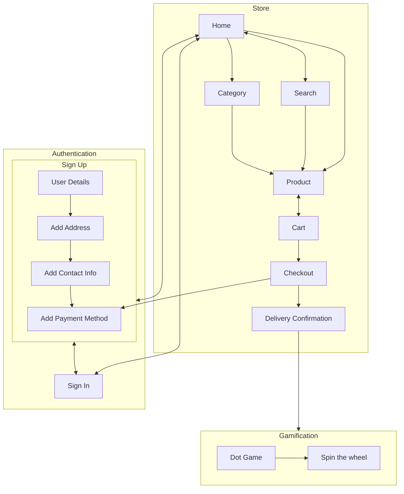

# Project Scoop - ID Assignment 2

Welcome to Project Scoop! 

Finding current style of ecommerce website as well as the checkout process boring? Well, we got you. Presenting to you a new and improved website for the brand, Scoop Wholefoods. This updated platform allows users to view and purchase in-stock items of their choice while earning rewards and discounts as a member. In addition to that, gamification features have been added to elevate users’ shopping experience. 

From attracting the user’s attention to enhancing every user’s shopping experience, all features and design are researched, refined and well-thought of from all aspects. An upgrade of the UI and UX will definitely bring in more users as well as more returning users while standing out from the crowd. The process has been streamlined to ensure a smoother flow from signing up to checking out.  This modern and minimalistic website is created with the goal of a seamless purchase and transaction process. 
## Design Process
### Phase One - Ideation
When we first received this assignment, we were given multiple projects to work with. After much consideration, we decided to proceed with an ecoomerce website with an addition of gamification features as we able to execute most of the requirements such as the usage of API(s) and Lottie animation. 

As we looked into other e-commerce websites, large and small, such as Lazada and Shoppe, we felt that these sites were plastered with popups and intrusive ads with a clunky user interfaces and we felt that we improve upon this experience by designing a new e-commerce platform with the user at the forefront. This meant rethinking how we could potentially upsell users with products through recommendations and rewards instead. As we looked through these sites, we noted down what we liked, as well as did not like in each website and these notes helped to guide the design of our final site.

One of the things features we loved when looking at other e-commerce websites was the use of product images to feature the product prominently, though we found the ads and promotions getting in the way of the site itself, often times burying important sections like Categories beneath dozens of ads. We felt that, as a user, the goal is to get it done as quickly as possible and these overly large product ads were getting in the way of the goal.

Deciding on the products was not an easy task. After hours of researching, we agreed to use [Scoop Wholefoods SG](https://sg.scoopwholefoods.com/) as a basis of the website. Knowing that there is also an ecommerce website for Sccop Wholefood, we decided to recreate the website with a brand new design alongside interesting features we thought the website could benefit from, such as a more comprehensive rewards system, including a spin the wheel game. Using the same products and category, we narrowed down to 6 different category with 10 products each to simpolify the project based on the lecturer's feedback. 

In this phase, we have identified the following: 
- end-users: Scoop e-commerce shoppers (members) and general public (non-members)
- end-goal: to recreate the existing site into a minimalistic website with improved functionality.  

### Phase Two - Design/Prototype
#### Front-End
While designing the website, we kept in mind of the useful features which can be implemented as well as user interactivity with the site while ensuring a smooth process throughout. Using Adobe XD as a wireframe tool, we started designing the mobile view of the app. 

The reason we designed the mobile view first was to ensure the design would ultimately scale nicely for users on smaller devices and by structuring the design similar to what we had seen in other mobile apps, we created a simple-to-use mobile optimised design that would work perfectly on any device.

That said, several screens had to be edited to suit the varying screen sizes, notably the moble product page was heavily inspired by other e-commerce apps, however this design didn't make much sense on larger devices such as desktops and the design had to be rethought out for such cases.

In order to maintain consistency throughout the design, we stuck to 5 colours.
- a dark blue for text
- 2 background colours
  - a light blue and white to provide some amount of contrast.
  - In general, the white was used to highlight any information that was in the foreground while the light blue was used to highlight elements in the background
- 2 accent colours
  - The blue served as our primary accent or tint colour throughout the entire project. Maintaining a consistent accent colour helped to ensure that the site looked similar as the user navigated between pages.
  - The yellow served as a secondary accent colour used to highlight any information such as progress bars.

Wireframe document: [shared link](https://xd.adobe.com/view/156c3b6b-6028-4da8-9f91-a24643752036-403f/)

A core consideration was how users would interact with the site itself, this led us to coming up with diagrams to map our user flows and how they would perform certain actions from authentication to purchasing a product and redeeming prizes.

Interactivity is a fundemental part of any website, and we aimed to incorporate this within our site too. 

One of the challenges we faced was "How do we make a button appear clickable?". With dozens of different types of buttons within the project, it was important that the user knew which areas were clickable and which areas were not. This led us to add many small effects such as adjusting shadows, inverting or changing colours when the user hovered over interactable interface elements to make it clear to the user that they were clickable.

One of the things we've learnt was the importance of empty states. These are screens to show when= there is no data present. As it can be frustrating at times when no data shows up, be it from a bad search query or simply because the store does not offer the product, we added custom empty states with animations powered by Lottie.

These little features allowed us to experiment with Lottie animations and customise animations using Adobe After Effects to create the exact animation we wanted that is consistent with the design theme within the site.

Throughout this, we also found out that animations can serve an important role in brightening up the site, giving it a more light-hearted feel. Above is an example from the confirmation screen with confetti to show that they can start playing games to win prizes.

#### Back-End
In order to allow products and categories to be easily updated, these information are stored within a [JSON file](https://github.com/jiachenyee/IDAssignment2/blob/main/resources/categories.json) and information from the file is loaded up based on the URL queries with products being identified by their SKUs (`/product?SKU=MyProductSKU`) and categories being identified by their name (`/category?name=MyCategoryName`). This allowed us to ensure the data could be easily modified if the store ever needed to add more products.

We added a sign in/up flow to keep track of customers and their points. We ultimately decided on [RestDB]() as our preferred database option thanks to the familiarity after tinkering around with it in class. This allowed us to integrate a database into our website and get the necessary data. When designing the original wireframes, we also thought about the data we were storing in the RestDB database and this helped us especially when coming to implementation.

An example of our purchases in RestDB.

Another consideration was what data to persist, and where to persist said data. We settled on storing the following information
- RestDB
  - **Members**: Store information about each member
  - **Purchases**: Store information about each purchase made
- Local Storage
  - **Member**: Store a copy of the user's information to ensure users do not need to sign in again everytime to use the service.
  - **Cart**: We felt that the cart did not need to be persisted in RestDB and could just be stored in local storage.

### Phase Three - Coding
After getting confirmation from our lecturer on our idea, we then proceed to start coding using the IDE, [Visual Studio Code](). Work is divided and delegated between the members based on the different sections of the website. Coding time is also carefully planned out in so as to prevent any conflict of the same code being edited at the same time. Knowing that more people view ecommerce websites on desktops, we decided to put more emphasis on the desktop version while setting the mobile version secondary in importance. We updated each other on our progress as we coded according to the wireframes design and helped out when problems or queries arise.

.......

### Phase Four - Test/Launch
In this final stage, we test each page making sure that all of the links and elements are working as intended. We also tried to launch the website on different browsers such as google chrome and safari. Many mistakes were made, from wrong colors to post/get request to the database. However, these were resolved through consultation with the lecturer and the internet. The process from sign in to the final checkout was tested mulitple times to ensure a smooth and successful run which will lead to satisfactory users. 

 

<!--commented out
Provide us insights about your design process, focusing on who this website is for, what it is that they want to achieve and how your project is the best way to help them achieve these things.

In particular, as part of this section we recommend that you provide a list of User Stories, with the following general structure:
- As a user type, I want to perform an action, so that I can achieve a goal.

This section is also where you would share links to any wireframes, mockups, diagrams etc. that you created as part of the design process. 
These files should themselves either be included as a pdf file in the project itself (in an separate directory)
Include the Adobe XD wireframe as a folder. You can include the XD share url. -->

## Features
### Existing Features
- Personalized Greeting
  - A personalized header containing the username will be displayed at the top of the Home Page for users who signs up for membership. A simple and general title, 'Hello' will be displayed instead for non-members.
  - Purpose: this feature provides a personalized feel by including the details of the users and this helps to improve user experience when they visit the website. 
  - {display}

- Search Bar
  - This general feature is located at the top of the Home Page, Product Page, Category Page, Cart Page and Payment Page. It allow users to navigate throughout the website to look for products which they have in mind. This helps to shorten the process of finding their desired products, improving the user experience. 
  - {display}

- Cart Button
  - Found at the top right corner of the Home Page, Product Page, Category Page, Cart Page and Payment Page, this features allow the ease of access to navigate to their checkout chart where they are able to view an overall of the products selected. This feature is only applicable to members as there is limited information of guests to enable them to use the feature. 
  - {display}

- Points Bar
  - This features is only available for members. When members checkout and made payment for their purchase, they are able to earn points depending on the amount and quantity of products purchased. The higher the amount spent, the more points earned. The limit on the total number of points accumulated is 1000 points. When the current points bar is full, it will reset to 0 points and the extra points are brought forward to the new bar. Every 1000 points earned will entitle members to play a few games and earn more rewards such as discounts and free products. With the implementation of this feature, non-members will be entice to sign up for membership and members can better visualize their progress of their points accumulation. 
  - {display}

- Quick Sign In and Sign Up 
  - The addition of two buttons in replacement of the points bar allows members to sign in or non-members to sign up to be able to purchase items and earn points. In guest mode, users are restricted to only view the products in each category but are able to carry out features set aside for members as mentioned in the previous line. Placed in the home page, users are able to easily access the sign in and sign up features
  - {display}

- For You/Popular Section
  - This feature found at the bottom of the home page introduces new and randomized products for users. A total number of 10 products will be displayed for the users. For members, the section is named 'For You' to add touch in personalization while the section is named 'Popular' for non-members. --more--
  - {display}

- Sold Out/New Logos
  - For products which are just released into the store, they are labelled with the 'New' logo, whereas for products which are unavailable due to limited or no stock will be labelled with the 'Sold Out' logo. 
  - {display}

- Products Display
  - Store items are presented to users in the form of cards with the item name, price and image. Due to time constraint, only 10 images from each of the 6 categories are displayed and users are able to click on any of the items which brings them to a product description and add to cart page. 
  - {display}

- Filters 
  - For each product in the Products Page, there are filters added at the bottom of the product name to provide more information such as Vegan and Halal for better understanding of the product. For the collated products in each category are also provided with the relevent filters containing the product category name for easier reference. 
  - {display}

- Selected Product 
  - When users select their preferred product, they are brought to a page where they are provide with the product description and they are able to checkout this product with a maximum quanitty of 10. They are also provided with the price alongside their points bar. They are only able to add the products, they set sight on, to the main cart in this page. 
  - {display}

- View Cart
  - In this page, users are able to have an overall view of the items in their cart as well as its quantity. The prices of the items are summed up and diplayed in the payment card alongside the price of the tax (GST) and the final payment price. The points bar is also added into this section, giving the users a better understanding nad view 

- Confirm Payment

- predicted points bar 

- success page 

- animation 

- hyperlink 

- data validation 

- Add card

- Jumping Game 

- Wheel Game

### Features Left to Implement
- 

## Technologies Used
The following are the various languages, frameworks, libraries, and any other tools used to construct this project. 

- [HTML](https://html.com/)
- The project uses **HTML** to describe the structure of web pages.
- [CSS](http://css.com/)
  - The project uses **CSS** to describe the presentation of web pages, including colors, layout and fonts.
- [JavaScript](https://www.javascript.com/)
  - The project uses **JavaScript** to create highly responsive  and interactive interfaces that improve user experience and provide dynmic functionality.
- [JSON](https://www.json.org/)
  - The project uses **JSON** to transmit data in web applications. 
- [JQuery](https://jquery.com)
  - The project uses **JQuery** to simplify DOM manipulation.????????????????
- [Adobe XD](https://www.adobe.com/sg/products/xd.html)
  - The project uses **XD** as a design platform to create the prototypes/wireframes.
- [GitHub](https://github.com/)
  - The project uses **GitHub** uses a code hosting platform for version control and collaboration.
- [VSC](https://code.visualstudio.com/)
  - This project uses **Visual Studio Code** as a source-code editor for development operations like debugging, task running and version control.
- [RestDB]()
  - This project uses **RestDB** as a database tool to store user's information and purchase.

## Testing
1. Forms 
      1. Sign In
      2. Sign Up 
      3. Address
      4. Payment 
      5. Card
2. Home Page
3. Product(selected) Page
4. Category Page
5. Cart Page
6. Checkout/Payment Page 
7. Success Page
8. Games 
      1. Jumping Dot
      2. Spin the Wheel 

For any scenarios that have not been automated, test the user stories manually and provide as much detail as is relevant. A particularly useful form for describing your testing process is via scenarios, such as:

1. Contact form:
    1. Go to the "Contact Us" page
    2. Try to submit the empty form and verify that an error message about the required fields appears
    3. Try to submit the form with an invalid email address and verify that a relevant error message appears
    4. Try to submit the form with all inputs valid and verify that a success message appears.

In addition, you should mention in this section how your project looks and works on different browsers and screen sizes.

You should also mention in this section any interesting bugs or problems you discovered during your testing, even if you haven't addressed them yet.

If this section grows too long, you may want to split it off into a separate file and link to it from here.

## Credits
### Content and Media
- Product Information - Name, Description, Price, Image are taken from [Scoop Wholefoods SG](https://scoopwholefoodsshop.com/collections/shop-all)
- Icons - The relevant icons are taken from [Icon]()
- Fonts - IBM Plex Sans, font used throughout the website, is taken from [Google Fonts]()
- Animation - The animated truck was taken from [Lottie]() 
- Animation - The animated truck was taken from [Lottie]() 

### Acknowledgements
- [MEL]() - Reference on lesson materials and links.
- [W3 Schools]() - Reference on html, css and other content.
- [YouTube]() - Reference was taken for certain codes such as games.  
- [Stack Overflow]() - Reference on codes for specific content such as data validations for forms.

### Authors
- Lead Authors
    - Yee Jia Chen (Student)
    - Yong Zong Han Ryan (student) 

- Co-Author
    - Suresh Kumar Moorkath (lecturer)
